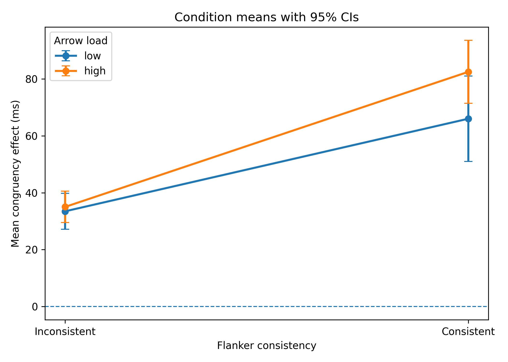

# Flanker Interference Reanalysis

This repository documents a reproducible reanalysis of data from a classroom Eriksen flanker experiment. The project reorganizes a raw spreadsheet export into block-level and subject-level datasets, reproduces the original repeated-measures ANOVA, and extends the workflow with a block-level mixed-effects model and descriptive error checks.

The emphasis is methodological rather than substantive: data restructuring, repeated-measures inference, hierarchical thinking, transparent limitations, and reproducible reporting.

## Research Question

How do **arrow load** (5 vs 7 arrows) and **flanker consistency** (consistent vs inconsistent non-target arrows) change the **congruency effect** in reaction-time data?

Here, the congruency effect is defined as:

`RT_incongruent - RT_congruent`

A larger positive value indicates stronger behavioral interference.

## Why this version is portfolio-ready

Instead of uploading the original course submission, this repository presents the strongest research-training signal in the project:

- reconstruction of a messy raw export into analysis-ready data
- validation that the reconstructed summary reproduces the original summary exactly
- replication of the original 2 x 2 repeated-measures ANOVA
- extension to a block-level mixed-effects model
- descriptive error analysis and missingness reporting
- explicit statement of design and inference limits

## Data Structure

- `data/raw/flanker_block_export.csv`: original classroom spreadsheet export
- `data/raw/flanker_subject_summary_original.csv`: original 48-row summary file
- `data/processed/flanker_block_level.csv`: reconstructed block-level dataset (240 rows)
- `data/processed/flanker_subject_summary.csv`: reconstructed subject-level dataset (48 rows)

The reconstructed subject-level summary matches the original summary exactly:
- matched rows: 48 / 48
- maximum absolute difference: 0 ms

## Analysis Workflow

1. Parse the original export into a block-level tidy dataset.
2. Aggregate block-level data to a subject-level summary.
3. Validate the reconstructed summary against the original file.
4. Reproduce the 2 x 2 repeated-measures ANOVA.
5. Reanalyze the block-level data with a mixed-effects model.
6. Summarize error patterns and document missingness.
7. Generate portfolio-ready figures.

## Main Results



### Subject-level repeated-measures ANOVA

- **Arrow load:** F(1, 11) = 4.80, p = 0.051, partial eta squared = 0.304
- **Flanker consistency:** F(1, 11) = 67.56, p < .001, partial eta squared = 0.860
- **Interaction:** F(1, 11) = 2.82, p = 0.121, partial eta squared = 0.204

### Condition means

- Low / Inconsistent: 33.48 ms
- Low / Consistent: 66.02 ms
- High / Inconsistent: 35.02 ms
- High / Consistent: 82.50 ms

### Within-load contrasts

- Low load, consistent minus inconsistent: 32.54 ms, t(11) = 4.19, Holm-adjusted p = 0.0015
- High load, consistent minus inconsistent: 47.48 ms, t(11) = 9.19, Holm-adjusted p = 0.0000

### Block-level mixed-effects model

Using the block-level dataset and a participant random intercept:

- **Intercept (low / inconsistent):** 33.48 ms
- **Arrow load effect at inconsistent condition:** 1.54 ms, p = 0.832
- **Consistency effect at low load:** 32.54 ms, p < .001
- **Interaction:** 14.94 ms, p = 0.146

The block-level model supports the same qualitative interpretation as the subject-level ANOVA: a strong consistency effect, weak evidence for arrow load, and no clear interaction.

### Error patterns

Error fields are partially missing for participants 5 and 6 under low-load conditions, so accuracy analyses are descriptive rather than inferential.

Observed mean error counts:

- Low / Inconsistent: 1.50
- Low / Consistent: 2.39
- High / Inconsistent: 1.35
- High / Consistent: 1.78

Across complete subject-condition means, larger congruency effects were positively associated with larger error counts (r = 0.46, p = 0.002; n = 44), which is a reason to report accuracy alongside reaction-time outcomes rather than ignoring it.

## Repository Structure

```text
flanker-interference-reanalysis/
├── README.md
├── requirements.txt
├── data/
│   ├── raw/
│   └── processed/
├── scripts/
│   ├── utils.py
│   ├── 01_parse_raw_export.py
│   ├── 02_validate_reconstructed_summary.py
│   ├── 03_reproduce_rm_anova.py
│   ├── 04_block_level_mixed_model.py
│   ├── 05_error_analysis.py
│   └── 06_make_figures.py
├── results/
│   ├── figures/
│   └── tables/
└── docs/
    ├── attribution.md
    ├── data_dictionary.md
    ├── limitations.md
    └── study_design.md
```

## Reproducibility

Create an environment and install the dependencies:

```bash
pip install -r requirements.txt
```

Run the workflow in order:

```bash
python scripts/01_parse_raw_export.py
python scripts/02_validate_reconstructed_summary.py
python scripts/03_reproduce_rm_anova.py
python scripts/04_block_level_mixed_model.py
python scripts/05_error_analysis.py
python scripts/06_make_figures.py
```

## How to present this project on a PhD-facing GitHub

Present it as a **methods-oriented reanalysis**, not as a standalone cognitive-neuroscience discovery project.

Recommended one-line description:

> Reorganized raw behavioral data from a classroom Eriksen flanker experiment into a reproducible analysis workflow, reproducing repeated-measures ANOVA results and extending them with block-level mixed-effects reanalysis.

## Attribution and limitations

This repository is based on collaboratively collected classroom data. The public version should be framed as an individual reanalysis, documentation, and reproducibility project.

See:
- `docs/attribution.md`
- `docs/limitations.md`
